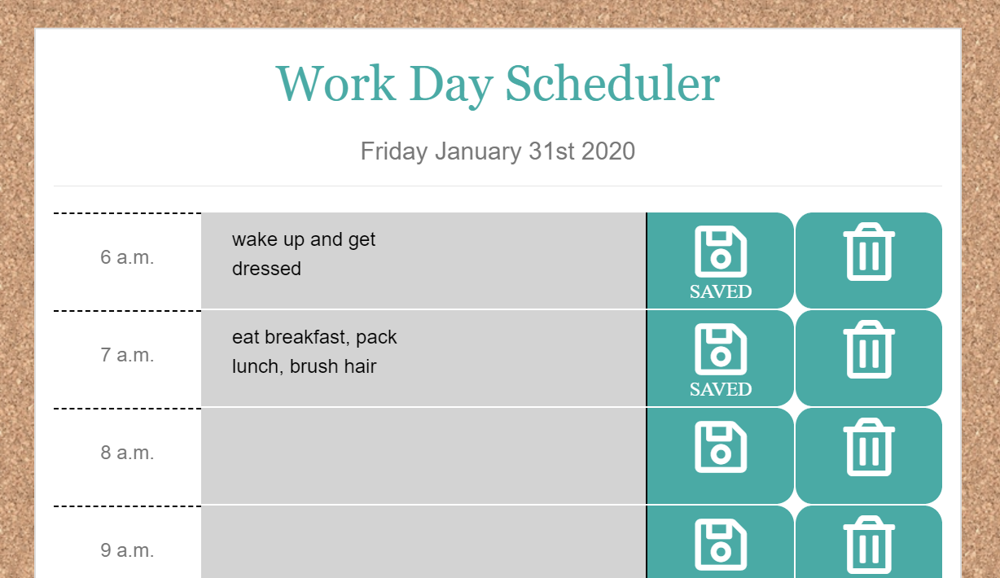
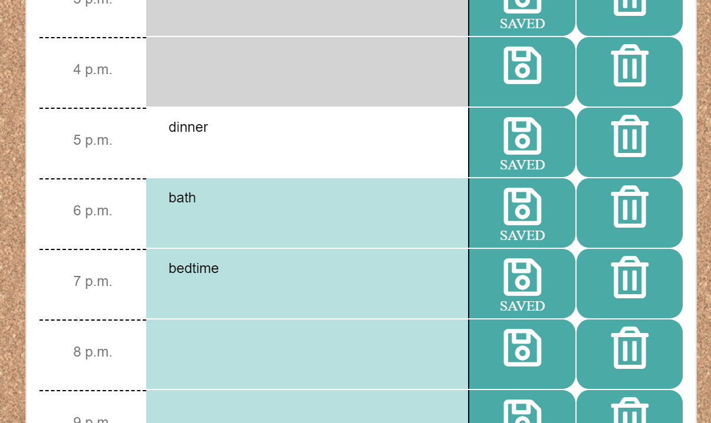

# workday-scheduler
Assignment 5 - Work Day Scheduler

## Assignment Description

Create a simple calendar application that allows the user to save events for each hour of the day. This app will run in the browser and feature dynamically updated HTML and CSS powered by jQuery.

You'll need to use the Moment.js library to work with date and time. Be sure to read the documentation carefully and concentrate on using Moment.js in the browser.

## Links

[github source](https://github.com/yttel/workday-scheduler)

[deployed site](https://yttel.github.io/workday-scheduler/)

## Screenshots

